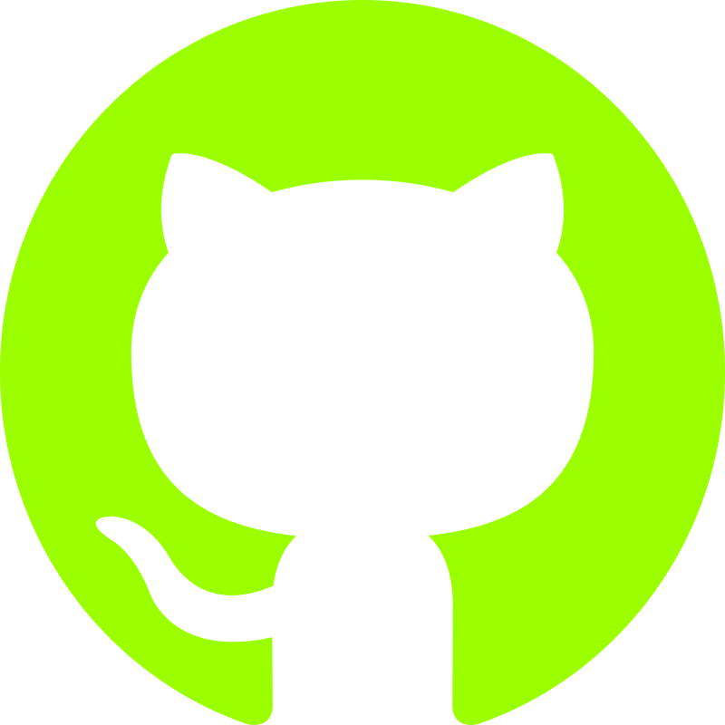

<!-- Hero Banner -->
<p align="center">
  
</p>

<!-- About Section -->
<h2 id="about">About</h2>

<!-- Labels -->
<p align="left">
  
  
  
</p>
<p>
I am Kai, a cybersecurity professional from <b>Johor, Malaysia</b> , currently living in <b>Auckland, New Zealand</b> .
</p>

<!-- Contact Icons -->
<p align="left">
  <a href="https://www.linkedin.com/in/kai-cybersecurity">
    
  </a>
  &nbsp;&nbsp;&nbsp;
  <a href="https://github.com/wxnkai">
    
  </a>
  &nbsp;&nbsp;&nbsp;
  <a href="mailto:work.wenkai@gmail.com">
    
  </a>
</p>

```bash
$ whoami
Kai\Aspiring-Red-Team-Professional

$ echo PROFILE
Location   = "Auckland, NZ"
Education  = "BSc Computer Science — Universiti Tunku Abdul Rahman"
Focus      = "Offensive Security | Detection Engineering | Software Engineering"
Motto      = "Build things, break things, fix things, learn & repeat"

$ echo ACTIVITIES
🔍 Continuous_Study = "Exploitation techniques, detection engineering, cloud security, networking"
🧩 HandsOn_Training = "Active on TryHackMe / Hack The Box — labs, CTFs, purple-team exercises"
🐛 Bug_Bounty       = "Vulnerability research & responsible disclosure (hobbyist)"
⚒️ Tooling          = "Scripting & automation for red/blue experiments (Python, Bash, PowerShell)"

$ echo CONTACT
LinkedIn = "linkedin.com/in/kai-cybersecurity"
GitHub   = "github.com/wxnkai"
Email    = "work.wenkai@gmail.com"

$ cat <<'NOTE_BANNER'

┏━━━━━━━━━━━━━━━━━━━━━━━━━━━━━━━━━━━━━━━━━━━━━━━━━━━━━━━━━━━━━━┓
┃  NOTE: OPEN TO ROLES — Red Team / Security Engineering       ┃
┃  Actively seeking opportunities.                             ┃
┗━━━━━━━━━━━━━━━━━━━━━━━━━━━━━━━━━━━━━━━━━━━━━━━━━━━━━━━━━━━━━━┛

NOTE_BANNER
```

<!-- Skills Section -->
<details>
  <summary id="skills"><h2>Skills and Stack</h2></summary>

  <h3>🧑‍💻 Programming & Scripting</h3>
  <p>
    <a href="https://github.com/search?q=owner%3Awxnkai+language%3APython">
      
    </a>
    <a href="https://github.com/search?q=owner%3Awxnkai+language%3AJava">
      
    </a>
    <a href="https://github.com/search?q=owner%3Awxnkai+language%3AJavaScript">
      
    </a>
    <a href="https://github.com/search?q=owner%3Awxnkai+language%3AC">
      
    </a>
    <a href="https://github.com/search?q=owner%3Awxnkai+language%3AC%2B%2B">
      
    </a>
    <a href="https://github.com/search?q=owner%3Awxnkai+language%3ASolidity">
      
    </a>
    <a href="https://github.com/search?q=owner%3Awxnkai+language%3APHP">
      
    </a>
    <a href="https://github.com/search?q=owner%3Awxnkai+language%3AShell">
      
    </a>
    <a href="https://github.com/search?q=owner%3Awxnkai+language%3APowerShell">
      
    </a>
    <a href="https://github.com/search?q=owner%3Awxnkai+language%3AHTML">
      
    </a>
    <a href="https://github.com/search?q=owner%3Awxnkai+language%3ACSS">
    </a>
  </p>

  <h3>☠️ Cybersecurity Tools</h3>
  <p>
    <a href="https://github.com/search?q=owner%3Awxnkai+language%3AMetasploit">
      
    </a>
    <a href="https://github.com/search?q=owner%3Awxnkai+language%3ABurp_Suite">
      
    </a>
    <a href="https://github.com/search?q=owner%3Awxnkai+language%3ANmap">
      
    </a>
    <a href="https://github.com/search?q=owner%3Awxnkai+language%3AWireshark">
      
    </a>
    <a href="https://github.com/search?q=owner%3Awxnkai+language%3AHTML">
      
    </a>
  </p>

  <h3>💻 Operating Systems</h3>
  <p>
    <a href="https://github.com/search?q=owner%3Awxnkai+Windows">
      
    </a>
    <a href="https://github.com/search?q=owner%3Awxnkai+Linux">
      
    </a>
    <a href="https://github.com/search?q=owner%3Awxnkai+Kali%20Linux">
      
    </a>
    <a href="https://github.com/search?q=owner%3Awxnkai+Ubuntu">
      
    </a>
  </p>

  <h3>🛢 Databases</h3>
  <p>
    <a href="https://github.com/search?q=owner%3Awxnkai+MongoDB">
      
    </a>
    <a href="https://github.com/search?q=owner%3Awxnkai+SQLite">
      
    </a>
  </p>

  <h3>☁️ Cloud</h3>
  <p>
    <a href="https://github.com/search?q=owner%3Awxnkai+AWS">
      
    </a>
    <a href="https://github.com/search?q=owner%3Awxnkai+Azure">
      
    </a>
    <a href="https://github.com/search?q=owner%3Awxnkai+GCP">
      
    </a>
    <a href="https://github.com/search?q=owner%3Awxnkai+Cloudflare">
      
    </a>
    <a href="https://github.com/search?q=owner%3Awxnkai+Firebase">
      
    </a>
  </p>

  <h3>🪛 Other Tools</h3>
  <p>
    <a href="https://github.com/search?q=owner%3Awxnkai+Git">
      
    </a>
    <a href="https://github.com/search?q=owner%3Awxnkai+GitHub">
      
    </a>
    <a href="https://github.com/search?q=owner%3Awxnkai+GitHub%20Actions">
      
    </a>
    <a href="https://github.com/search?q=owner%3Awxnkai+Figma">
      
    </a>
    <a href="https://github.com/search?q=owner%3Awxnkai+VS%20Code">
      
    </a>
    <a href="https://github.com/search?q=owner%3Awxnkai+Notion">
      
    </a>
    <a href="https://github.com/search?q=owner%3Awxnkai+Docker">
      
    </a>
    <a href="https://github.com/search?q=owner%3Awxnkai+Postman">
      
    </a>
    <a href="https://github.com/search?q=owner%3Awxnkai+LaTeX">
      
    </a>
    <a href="https://github.com/search?q=owner%3Awxnkai+Markdown">
      
    </a>
    <a href="https://github.com/search?q=owner%3Awxnkai+Obsidian">
      
    </a>
    <a href="https://github.com/search?q=owner%3Awxnkai+Notion">
      
    </a>
  </p>
</details>

<!-- Featured Projects -->
<details>
  <summary><h2 id="projects">Featured Projects</h2></summary>
  <p align="center">

```bash
┏━━━━━━━━━━━━━━━━━━━━━━━━━━━━━━━━━━━━━━━━━━━━━━━━━━━━━━━━━━━━━━┓
┃                                                              ┃
┃                    UNDER CONSTRUCTION                        ┃
┃                                                              ┃
┗━━━━━━━━━━━━━━━━━━━━━━━━━━━━━━━━━━━━━━━━━━━━━━━━━━━━━━━━━━━━━━┛
```

  </p>
</details>

<!-- Writeups -->
<details>
  <summary><h2 id="writeups">Writeups</h2></summary>
  <p align="center">

```bash
┏━━━━━━━━━━━━━━━━━━━━━━━━━━━━━━━━━━━━━━━━━━━━━━━━━━━━━━━━━━━━━━┓
┃                                                              ┃
┃                    UNDER CONSTRUCTION                        ┃
┃                                                              ┃
┗━━━━━━━━━━━━━━━━━━━━━━━━━━━━━━━━━━━━━━━━━━━━━━━━━━━━━━━━━━━━━━┛
```

  </p>
</details>

<!-- GitHub Stats -->
<details>
  <summary><h2 id="stats">GitHub Stats</h2></summary>

  <p align="center">
    
    
    
  </p>

  <p align="center">
    
  </p>
</details>